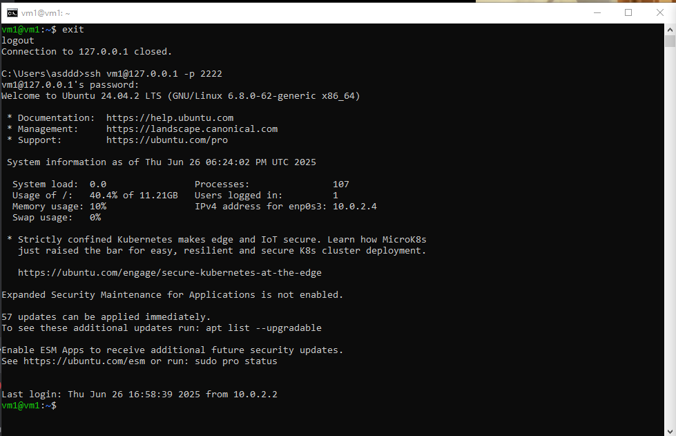
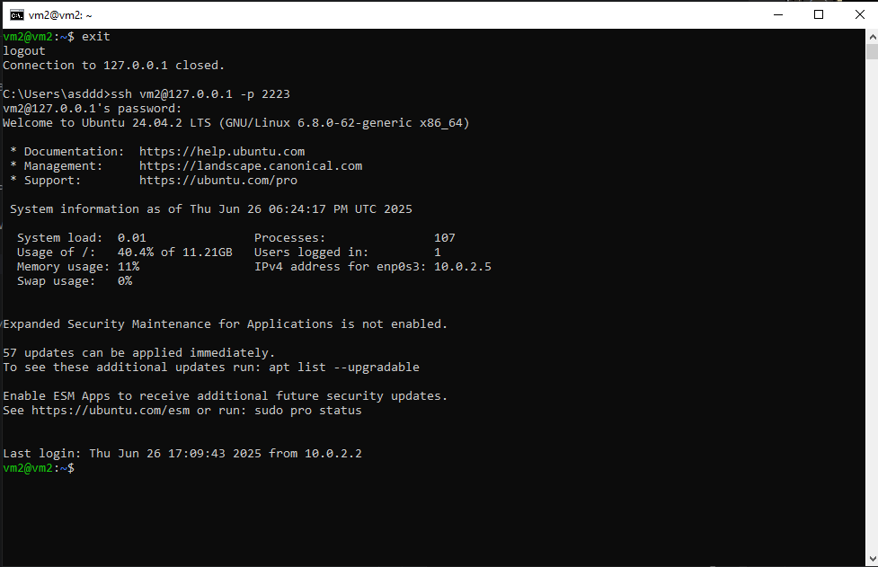
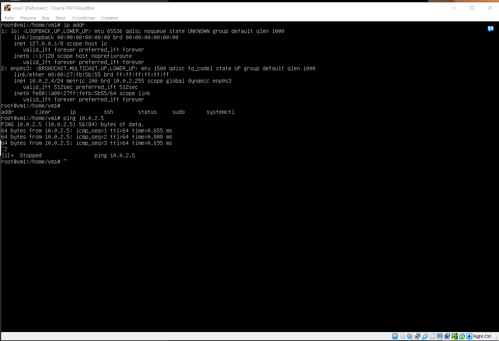
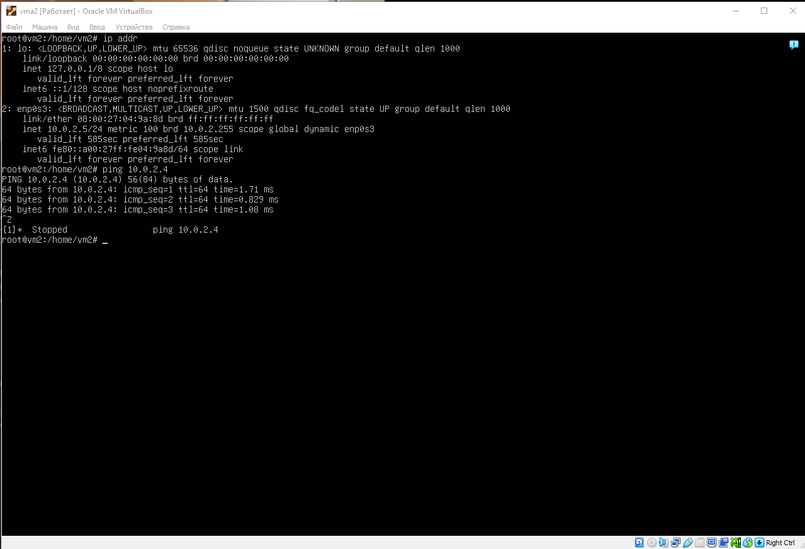

### Часть 1

Виртуальные машины были подняты при помощи VirtualBox. Название первой vm1,
второй vm2. Настройки сетевого соединения:
1. Зашел в Инструменты:Сеть в VirtualBox
2. Зашел в "Сети NAT" и создал сеть.
3. Задал IPv4 префикс 10.0.2.0/24, включаем DHCP
4. Прокидываем порты для каждой виртуальной машине, задаем произвольные имена для каждой виртуальной машины, задаем общий порт гостя 22 и разные порты хоста, то есть 2222 и 2223.
5. Устанавливаем и запускаем SSH на виртуальных машинах, при помощи команд: sudo apt install openssh-server; sudo systemctl enable ssh; sudo systemctl start ssh; 
6. Подключаемся в командной строке к каждой виртуальной машине ssh vm1@127.0.0.1 -p 2222 и ssh vm2@127.0.0.1 -p 2223

Подключение к Vm1

Подключение к Vm2

Проверка доступа виртуальных машин

vm1:

vm2:

Таким образом имеется локальное подключение между двумя виртуальными машинами, сами машины имеют доступ в интернет, а также к ним имеется подключение по SSH.

