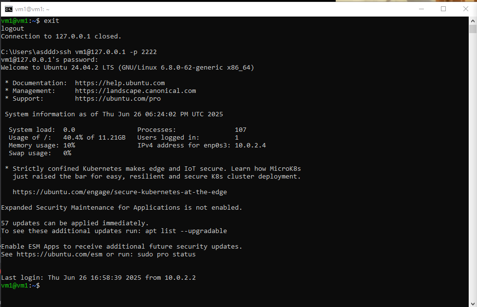
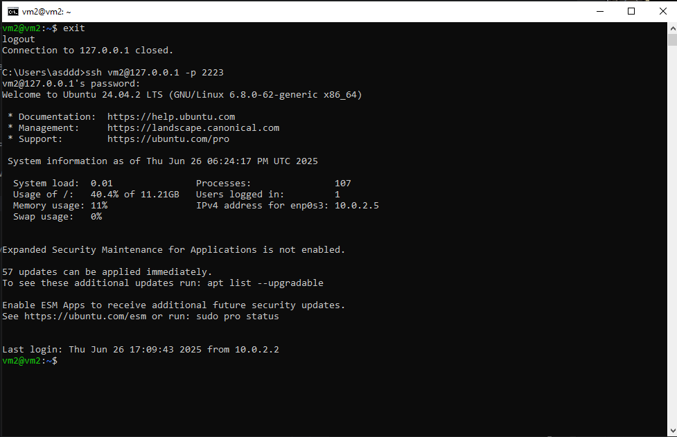
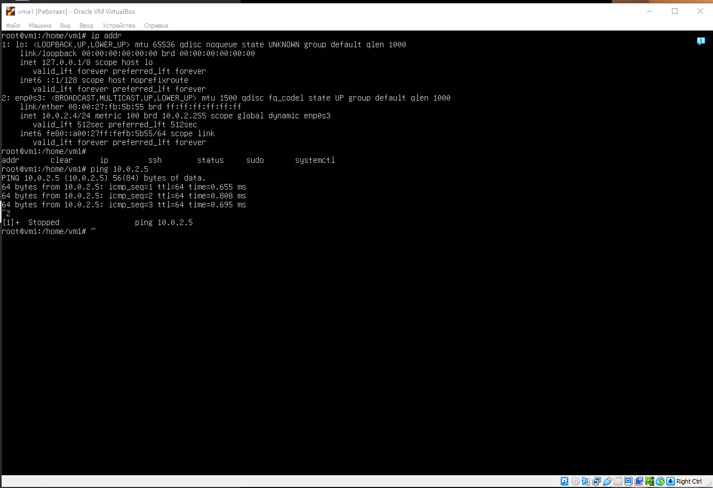
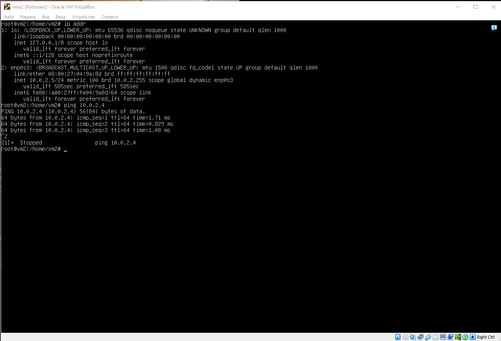
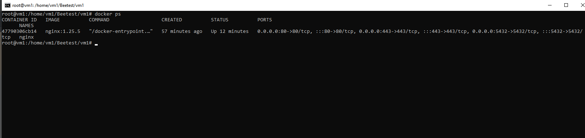
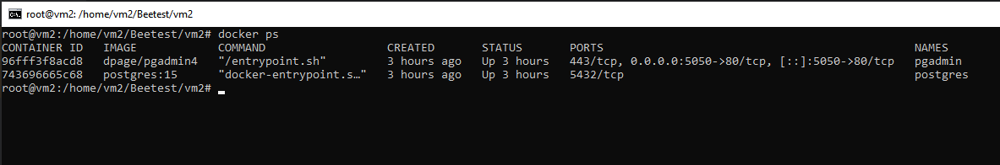
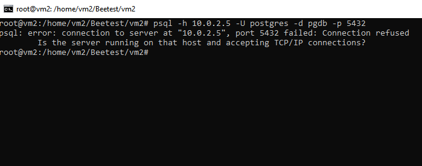
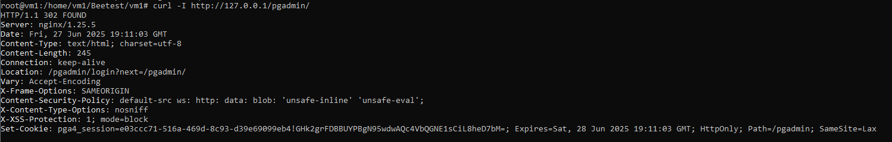
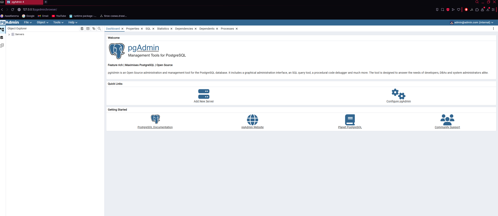
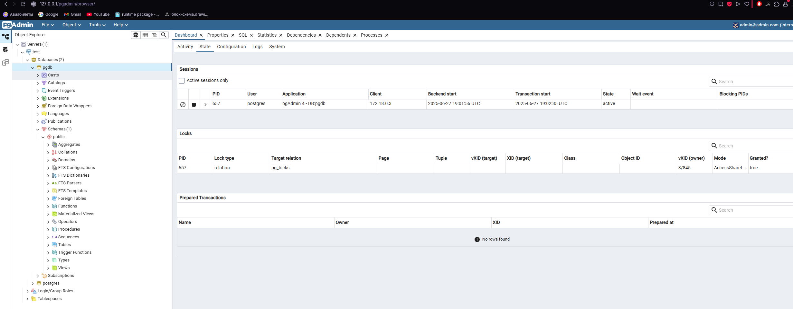

### Часть 1

Виртуальные машины были подняты при помощи VirtualBox. Название первой vm1,
второй vm2. Настройки сетевого соединения:
1. Зашел в Инструменты:Сеть в VirtualBox
2. Зашел в "Сети NAT" и создал сеть.
3. Задал IPv4 префикс 10.0.2.0/24, включаем DHCP
4. Прокидываем порты для каждой виртуальной машине, задаем произвольные имена для каждой виртуальной машины, задаем общий порт гостя 22 и разные порты хоста, то есть 2222 и 2223.
5. Устанавливаем и запускаем SSH на виртуальных машинах, при помощи команд: sudo apt install openssh-server; sudo systemctl enable ssh; sudo systemctl start ssh; 
6. Подключаемся в командной строке к каждой виртуальной машине ssh vm1@127.0.0.1 -p 2222 и ssh vm2@127.0.0.1 -p 2223

Подключение к Vm1

Подключение к Vm2

Проверка доступа виртуальных машин

vm1:

vm2:

Таким образом имеется локальное подключение между двумя виртуальными машинами, сами машины имеют доступ в интернет, а также к ним имеется подключение по SSH.

### Часть 2-3

Был развернут контейнер nginx с помощью docker-compose на первой машине и postgresql и pgadmin на второй. nginx запускается и видно подключение

Контейнеры с pgadmin и postgresql

Следующим шагом следует настройка nginx.conf и docker-compose.yml у второй виртуальной машины. 
nginx.conf:
Настроил проксирование HTTP и TCP-трафика на pgAdmin и PostgreSQL, расположенного на второй виртуальной машине.
Для этого настроил прием запросов и перенаправление на pgAdmin на второй машине, настроил нужные заголовки, чтоб pgAdmin знал,
что он обслуживается под префиксом /pgadmin.
Настроил stream-проксирование порта 5432, которая проксирует адрес на postgresql на вм2, что позволяет обращаться к базе через
psql -h <ВМ1> извне (P.S. У меня с этим возникли трудности, ибо все порты я открыл, все прокинул, но обратится с помощью psql -h не
получилось)

docker-compose.yml (виртуальная машина 2):
Инициализировал базу, пользователя. Настроил работу через префикс и внешний интерфейс pgAdmin. Связал оба контейнера сетью
и задал volume для постоянного хранения данных postgresql.

curl к pgadmin

Таким образом, когда мы пишем IP/pgadmin у нас идет автоматическая переадресация на login

Можем залогинится админом

Смог создать подключение с БД

Таким образом, настроено nginx с проксированием на pgadmnin с postgresql на другой виртуальной машине.
Какие сложности были с настройкой. При изначальной настройке, выключался контейнер с pgAdmin при запросе к нему, проблема
оказалась в том, что был неверно указан префикс под которым он будет обслуживаться и с пробросом портов, при правильной настройке
префикса и портов все заработало.